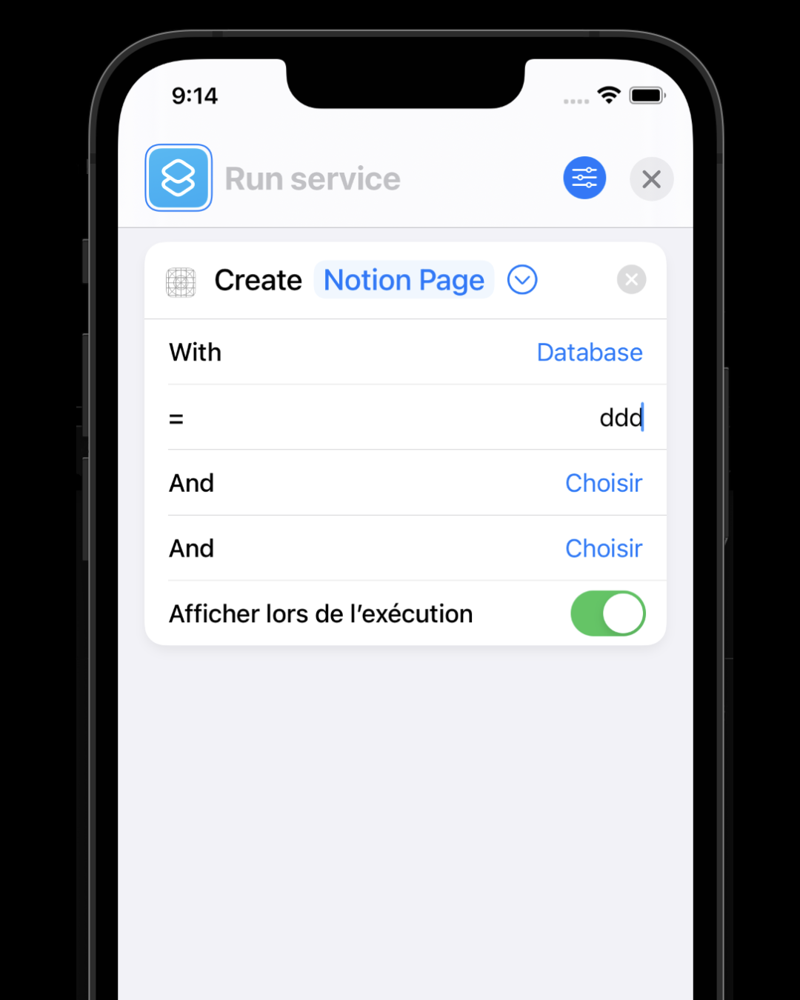
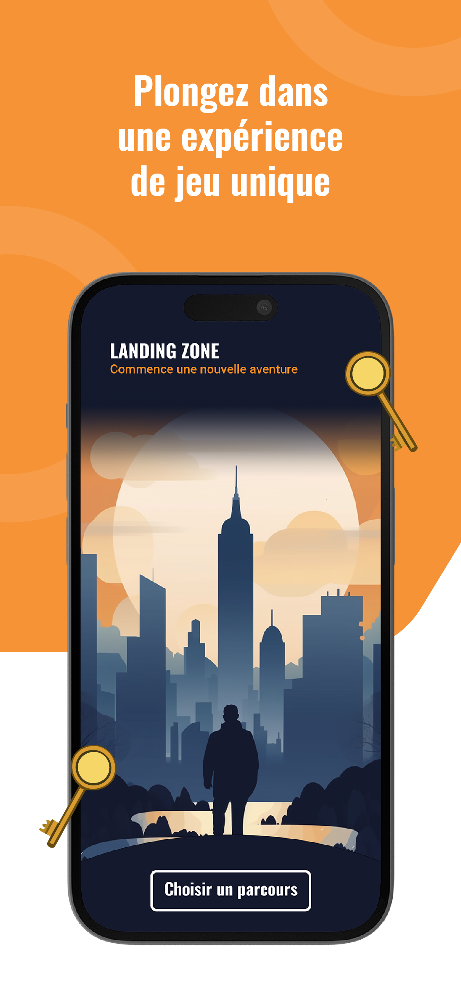
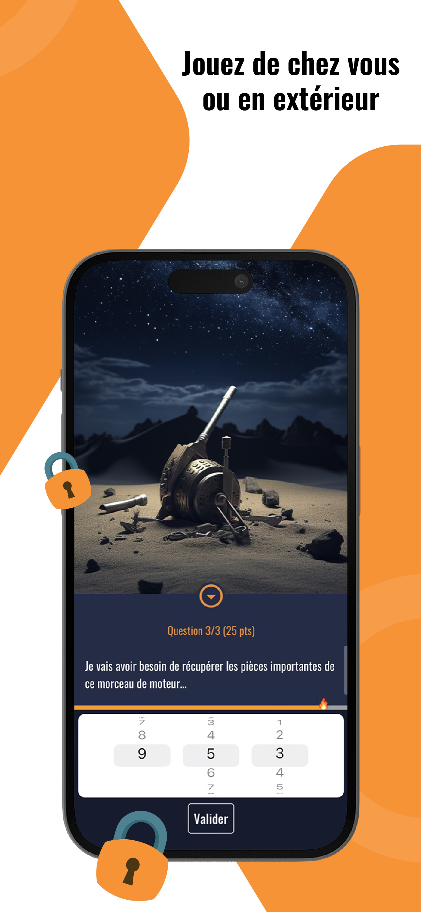
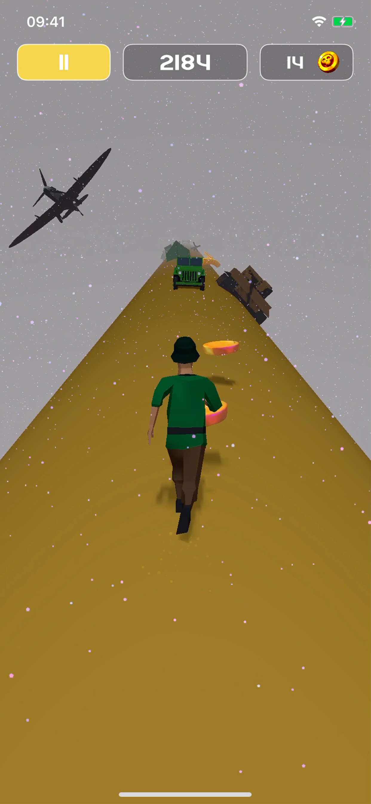
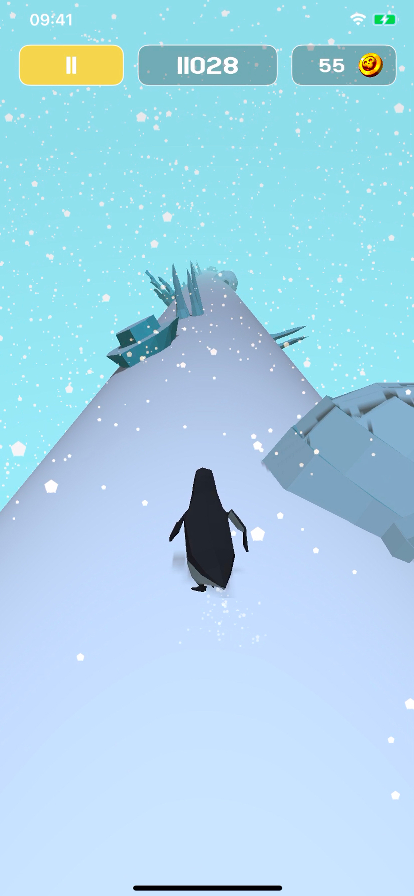

# Développeur mobile et web

Je suis développeur avec une expertise en développement web et mobile, diplômé d'Epitech. J'aide les entreprises à transformer leurs idées en projets numériques concrets.

---

## 🗓️ Mon parcours

| Année          | Expérience                                |
| -------------- | ----------------------------------------- |
| **2017-2022**  | Études à Epitech                          |
| **2021**       | Freelance Mobile                          |
| **2022-2023**  | Développeur chez Yaakadev                 |
| **2023-2024**  | Création de l’entreprise **Landing Zone** |
| **Maintenant** | Freelance Web et Mobile                   |

### **Epitech**
Diplômé du programme PGE d’Epitech, j’ai acquis des compétences solides en développement logiciel et gestion de projets.

### **Yaakadev**
J’ai développé des **sites web sur mesure** pour améliorer la productivité au sein des entreprises, ainsi que des **applications mobiles** pour la gestion d’équipes et des relations clients.

### **Freelance**
Depuis mes débuts en freelance, j’ai travaillé sur des projets variés dans les domaines **web** et **mobile**.

### **Ce que je propose**
- **Développement d’applications mobiles** pour l’App Store et le Play Store.
- Si nécessaire, le développement d’un **site web d’administration** pour vos applications.

---

## 🛠️ Technologies

### **Web**
- **Angular** (avec [Fuse](https://angular-material.fusetheme.com/dashboards/project) pour Angular)
- **NestJS** avec une base de données **MongoDB**
- **Heroku** pour le déploiement
- **Gitlab** pour l'hébergement
- **Amazon Simple Storage Service (S3)** pour le stockage des fichiers

### **Mobile**
- **Flutter**

---

## 💼 Quelques projets freelance

### **Blueprints**

Une application permettant de créer des actions personnalisées à la manière de Zapier, intégrée avec les raccourcis iOS.  

  

---

### **Landing Zone**

Une application interactive pour jouer à des parcours d’escape games, en extérieur ou en intérieur.
[Landing Zone](https://landingzone.app/)
📸 _[Ajouter des photos ici]_

  
  
  

---

### **Through the World**

Un jeu mobile casual où le joueur doit tenir le plus longtemps possible en affrontant des obstacles variés.  

  
  
  

---

### **Back Office Landing Zone**

Un site web permettant d’administrer l’application Landing Zone avec des fonctionnalités comme :
- Création de parcours
- Génération de codes de jeux
- Gestion des utilisateurs

  
  
  

---

Merci d'avoir visité mon portfolio ! 🚀 Si vous avez des projets de développement mobile, n'hésitez pas à me **[contacter](mailto:enki.corb@gmail.com)**.
